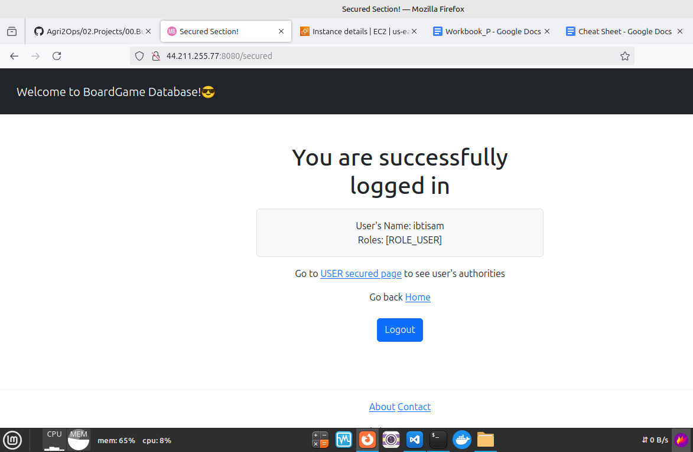

# BoardGameDB-JavaApp

## Description

**Board Game Database Full-Stack Web Application.**
This web application displays lists of board games and their reviews. While anyone can view the board game lists and reviews, users are required to log in to add or edit board games and their reviews. The application supports different roles with varying levels of permissions:
- **Non-members**: Can view board game lists and reviews.
- **Users**: Can add board games and write reviews.
- **Managers**: Can edit and delete reviews, in addition to the permissions of users.

## Technologies

- Java
- Spring Boot
- Thymeleaf
- Thymeleaf Fragments
- HTML5
- CSS
- JavaScript
- Spring MVC
- JDBC
- H2 Database Engine (In-memory)
- JUnit test framework
- Spring Security
- Twitter Bootstrap
- Maven

## Features

- **Full-Stack Application**: Combines front-end and back-end technologies.
- **UI Components**: Created with Thymeleaf and styled with Twitter Bootstrap.
- **Authentication and Authorization**: Implemented using Spring Security.
  - **Authentication**: Users authenticate with a username and password.
  - **Authorization**: Different permissions based on roles (non-members, users, and managers).
- **Role-Based Access Control**:
  - **Non-members**: View board game lists and reviews.
  - **Users**: Add board games and write reviews.
  - **Managers**: Edit and delete reviews.
- **Unit Testing**: JUnit test framework for unit testing.
- **Spring MVC Best Practices**: Segregates views, controllers, and database packages.
- **Database Connectivity**: JDBC for database interaction.
- **CRUD Operations**: Manage data in the database.
- **Schema Customization**: `schema.sql` file to customize the schema and input initial data.
- **Thymeleaf Fragments**: Reduce redundancy of repeating HTML elements (head, footer, navigation).

## How to Run

1. **Clone the Repository**
2. **Open the Project**: Open the project in your IDE of choice.
3. **Run the Application**: Execute the application from your IDE.
4. **Initial User Data**: Use the following credentials to log in:
        `src/main/java/com/javaproject/security/SecurityConfig.java`
   - **User Role**: 
     - Username: `ibtisam`
     - Password: `ibtisam`
   - **Manager Role**:
     - Username: `ibtisam`
     - Password: `ibtisam`
5. **Sign-Up**: You can also sign up as a new user and customize your role to explore the application.

## Project Structure

The project follows a standard Spring Boot structure with the following key directories and files:
- `src/main/java`: Contains the Java source code.
  - `controller`: Handles HTTP requests and responses.
  - `service`: Contains the business logic.
  - `repository`: Manages data access and database interactions.
  - `model`: Defines the data models and entities.
- `src/main/resources`: Contains configuration files and static resources.
  - `application.properties`: Configuration file for database and other settings.

Please refer to `consoleOutput.txt` for more details. 😊

## Docker Images

```bash
ibtisam@mint-dell:~/SilverOps/DevOps/DevOps-Tools/docker/01-JavaBoardGameDB-H2$ docker images
REPOSITORY                    TAG                  IMAGE ID       CREATED          SIZE
single-stage-build            latest               7de7322c5e69   3 minutes ago    487MB
multi-stage-build             latest               813bb4bfbf9a   11 minutes ago   374MB
```

## Project Snapshot

